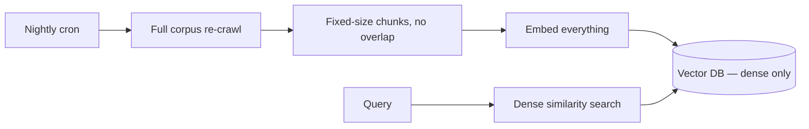
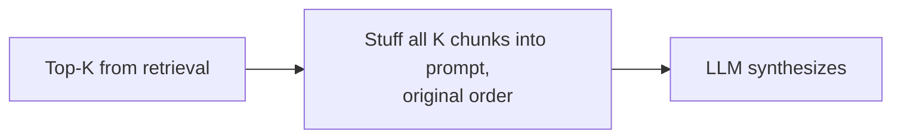
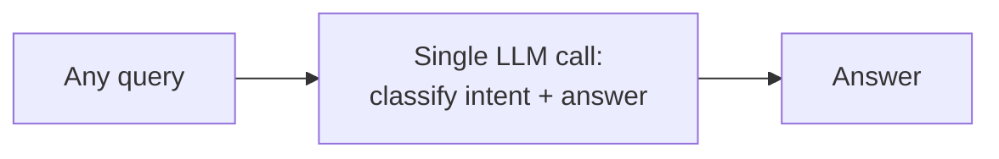
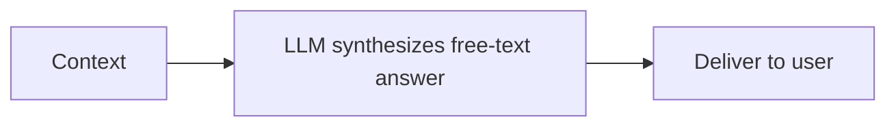
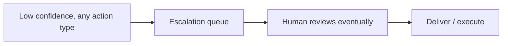
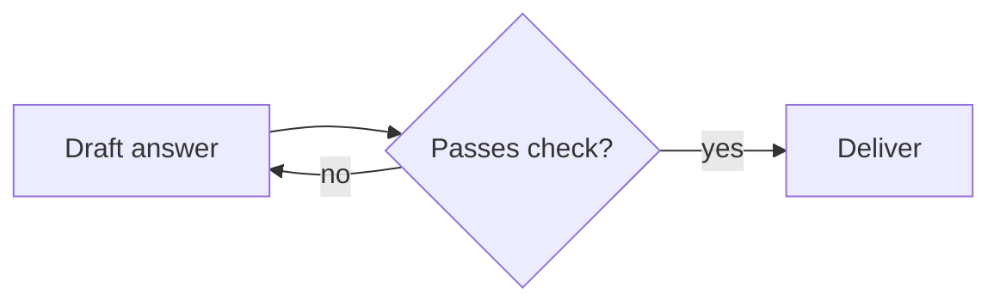
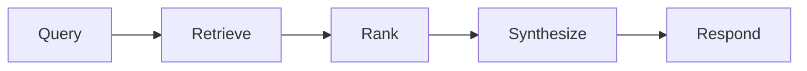

# Agentic AI Platform — Architecture Narratives (Modules 1–8)

Companion to `01_ingestion_retrieval.mermaid` through `08_end_to_end_overview.mermaid`. Same format as the Modules 9–17 narrative doc: what a competent mid-senior engineer ships first (V1), the production incident that broke it, and the principal-level design (V2) that the standalone diagram depicts.

Same meta-lesson applies here as the core interview thesis: **V1 designs optimize the happy path of a demo; V2 designs optimize the change rate of an enterprise.** Modules 1–8 are where that shows up hardest, because this is the request-path core — the part that runs on every single query, where a millisecond or a dollar of waste multiplies by traffic, and where a subtle bug (stale index, unstable ranking, over-eager auto-approval) erodes trust silently before anyone notices.

---

## Module 1 — Ingestion, Chunking & Hybrid Retrieval

**V1 (mid-senior):** Nightly full re-crawl of the corpus, fixed-size chunking (e.g. 512 tokens, no overlap), one embedding model, one vector index, cosine similarity top-K. It benchmarks well on a static test set.

**What went wrong:** Three compounding issues. Fixed-size chunking with zero overlap cut sentences in half at chunk boundaries, so the fact you needed was frequently split across two chunks and neither scored high enough to retrieve alone. Dense-only retrieval failed hard on exact-match lookups — product codes, ticket IDs, policy numbers — because embeddings are built for semantic similarity, not lexical precision, and a policy number like "POL-88213" embeds close to a hundred other alphanumeric strings. And the nightly full re-crawl meant a policy update published at 9am wasn't reflected until the next night's batch, which became a compliance problem the day a corrected safety procedure was cited in its *pre-correction* form to a customer.

**V2 (principal, see `01_ingestion_retrieval.mermaid`):** Event-driven ingestion filtered by change type (a metadata-only edit doesn't warrant re-indexing; only content changes trigger fetch), semantic chunking with ~10% overlap so boundary-split facts still surface, and deterministic chunk IDs (`hash(doc_id + seq_num)`) so re-indexing is idempotent rather than accumulating duplicate ghosts. The retrieval side is genuinely hybrid: dense search for semantic recall and BM25 sparse search for the exact-match cases dense embeddings are bad at, fused with Reciprocal Rank Fusion rather than a naive score average (RRF is rank-based, so it doesn't require the two systems' raw scores to be on comparable scales — a mistake that sinks naive fusion attempts). A hard `effective_date <= now()` filter drops chunks that are future-dated or superseded, which matters enormously for anything versioned (policy documents, pricing tables) where the newest version in the index isn't automatically the *currently effective* one. One easy-to-miss operational point that belongs in the diagram: the embedding API call is rate-limited and retried with backoff, and that latency gets mis-attributed as "retrieval is slow" in on-call rotations unless it's tracked as its own span — which is exactly why Module 7 gives it a dedicated one.

**Interview soundbites:** "Dense-only retrieval is a bet that your users never search for an exact string — enterprise users search for exact strings constantly." "RRF over naive score-averaging because rank fusion doesn't care that BM25 and cosine similarity live on different scales."

---

## Module 2 — Cross-Encoder Re-ranking & Context Window Assembly

**V1 (mid-senior):** Take the top-K from vector search, feed it to the LLM in whatever order it came back, and let the model figure out what's relevant. No re-ranking step at all — "the LLM is smart enough."

**What went wrong:** Two separate failure modes, both well-documented in the literature but painful to learn firsthand. First, "lost in the middle": with 8–10 chunks stuffed into the prompt, the single most relevant chunk was frequently buried at position 5 or 6, and answer quality measurably dropped versus putting it first — the model attends disproportionately to the start and end of a long context. Second, bi-encoder retrieval scores (used to rank the top-K in the first place) are a much weaker relevance signal than they look; a query and a document can be embedding-similar because they share vocabulary or topic while one doesn't actually answer the other, and stuffing all "similar-looking" chunks into context without a harder relevance check let subtly-wrong chunks influence the answer, particularly in comparative queries where two chunks about *different* products both scored well on similarity alone.

**V2 (principal, see `02_reranking_context_assembly.mermaid`):** A cross-encoder that jointly scores query+document (rather than comparing independently-embedded vectors) sits between retrieval and synthesis, and its output ordering — highest relevance first — directly targets the lost-in-the-middle problem rather than just improving precision. The design also treats the cross-encoder as a service with a failure mode: if it's down or times out, the system falls back to serving the RRF order directly in a degraded mode rather than blocking the whole request on a non-critical-path service — re-ranking improves quality, it shouldn't be a single point of failure for availability. Token budget is enforced *after* re-ranking, trimming to the top 2–3 highest-scored chunks rather than cramming in everything that fit under the K limit, because more context isn't free — it's more opportunity for an unrelated but scored chunk to introduce a subtly wrong fact, and it costs real money in input tokens. Source chunk IDs are carried through to assembly specifically so the eventual answer can cite exactly which chunk it drew from — this is the seam that lets Module 4's grounding checks and citation UI both work.

**Interview soundbites:** "Bi-encoder similarity gets you into the top 20; cross-encoder relevance gets you the top 3 — those are different jobs and conflating them cost us accuracy." "More context in the prompt isn't more information, it's more surface area for a wrong-but-similar chunk to leak in."

---

## Module 3 — Intent Classification & Confidence-Gated Routing

**V1 (mid-senior):** Route every query through a single LLM call that decides intent and generates the answer in one shot. Simpler pipeline, fewer moving parts.

**What went wrong:** Latency and cost, first — every query paid a full LLM round-trip just to figure out which product namespace it belonged to, before any actual retrieval happened. But the sharper failure was cross-namespace contamination: without an explicit routing step, retrieval searched the *entire* corpus for every query, and terminology overlap between product lines produced wrong answers with high confidence — a query about "device insurance" deductibles surfaced a chunk from "SMB onboarding" that happened to use the word "deductible" in an unrelated context, and the LLM, seeing a plausible-looking chunk, synthesized a confident, wrong answer. There was no cheap signal anywhere in the pipeline that would have prevented that search from happening in the first place.

**V2 (principal, see `03_intent_routing.mermaid`):** A lightweight, purpose-trained classifier (not a full LLM call — 20–40ms) makes the routing decision using the raw utterance plus a short window of conversation history. The key architectural decision is the confidence gate: above threshold, route to a specific, namespace-isolated retrieval scope, which both improves precision (no cross-contamination) and is cheaper (searching one namespace instead of the whole corpus); below threshold, don't force a guess — fall back to the full LLM path with complete conversation context, because a wrong high-confidence route is worse than an honest "this needs more context to resolve," and namespace isolation done wrong (forcing every query into a bucket) is how V1's contamination problem gets reintroduced with extra steps. The diagram also flags a specific enterprise nuance worth raising unprompted in an interview: routing informed by session state — not just the isolated current utterance — because users don't reset context between turns, and a classifier that only sees the current utterance will misroute anaphoric follow-ups ("what about the deductible on that one?") even when the classifier itself is accurate on single utterances.

**Interview soundbites:** "The router's job isn't to be right on every query, it's to be honest about when it isn't — false-confident routing is worse than falling back to full context." "Namespace isolation is a precision win and a cost win at the same time, which is rare enough to be worth designing around deliberately."

---

## Module 4 — Synthesis, NLI Contradiction Check & Structured Output

**V1 (mid-senior):** LLM reads the retrieved context, writes a free-text answer, done. Maybe a system-prompt instruction like "only answer from the provided context, don't make things up."

**What went wrong:** "Don't hallucinate" as a prompt instruction is a request, not a guarantee, and it fails in exactly the cases that matter most: when the context is close-but-not-quite an answer, the model fills the gap plausibly rather than declining, and it does so with the same confident tone as when it's fully grounded — so users (and dashboards) can't tell a fabricated answer from a real one just by reading it. The absence of a structured output format also meant there was nothing machine-checkable to gate on; "does this response mention the source" was answered by string-matching the free text, which was brittle and missed contradictions where the model correctly cited a source but subtly misstated the number or date it contained — a *contradiction*, not an absence, which prompt-level "cite your sources" instructions don't catch at all.

**V2 (principal, see `04_synthesis_guardrails.mermaid`):** The synthesis call outputs structured JSON (voice/display/sources/confidence) specifically so everything downstream is checkable rather than parsed from prose. Before anything ships, an explicit gate asks whether the answer is actually contained in the context — not "did the model cite something" but "is this claim supported" — and if not, the system emits `INSUFFICIENT_DATA` and halts rather than letting a plausible-sounding guess through; refusing to answer is a designed output state, not a failure state. Then an NLI (natural language inference) check runs premise-context against hypothesis-answer specifically to catch contradictions the citation-presence check misses — the case where the model cites the right document but changes a number or date in restating it. Worth naming honestly in an interview because it's a genuine open gap: NLI models sometimes miss contradictions that hinge on a single numeric substitution ("12 months" restated as "12 years") because the surrounding sentence structure is otherwise entailed — that's a known, documented weakness, not a solved problem, and the diagram calls it out rather than hiding it. PII/compliance scanning and LLM-as-judge scoring (faithfulness, relevance, context precision/recall) run after the contradiction check, and only responses clearing *all* thresholds auto-approve; anything failing any gate — insufficient data, contradiction, or below-threshold judge scores — routes to Module 5 for human review rather than shipping degraded.

**Interview soundbites:** "'Don't hallucinate' in a system prompt is a request the model can silently ignore under exactly the conditions where it matters most — you need a checkable gate after generation, not just an instruction before it." "We're honest in reviews that the NLI numeric-substitution gap is unsolved — a good judge score isn't proof of correctness, it's a filter that catches most things."

---

## Module 5 — Human-in-the-Loop: Read vs Write Trust Separation

**V1 (mid-senior):** One escalation path for everything below a confidence threshold: queue it, a human looks at it eventually, response goes out once approved. Same treatment whether it's an FAQ answer or an account-modifying action.

**What went wrong:** Treating reads and writes identically produces two opposite failures. Read-heavy traffic (informational Q&A) got needlessly bottlenecked on human review even when the risk of a wrong answer was low and recoverable, hurting response-time SLAs for the majority-safe case. Meanwhile a write action — "file this claim," "update this account" — that got the *same* generic queue treatment as a low-stakes FAQ answer created a genuinely dangerous pattern: on a retry after a timeout or a flaky network call, the action executed *twice*, because there was no idempotency guarantee and no explicit confirm-before-execute step distinguishing "the user approved this" from "the system decided to try again." A duplicated account update or a double-filed claim is a materially different failure than a slow FAQ answer, and one undifferentiated escalation path treated them the same.

**V2 (principal, see `05_human_in_the_loop.mermaid`):** The core design decision is bifurcating by action type, not just confidence. Read actions get a two-tier treatment: high confidence auto-approves and delivers immediately (with full audit logging even when no human touched it — "no human reviewed this" is itself an auditable fact), low confidence enqueues to a human reviewer with an SLA, and — the detail that prevents a queue backlog from becoming a silent outage — a timeout on that SLA defaults to a pre-defined safe fallback response rather than hanging indefinitely, with the timeout-and-fallback event itself logged distinctly from a genuine human decision. Write actions never go through the confidence-gated read path at all: the guardrail service generates a *proposed diff* that is explicitly not executed, the user is shown that diff and asked to confirm, and only on confirmation does execution happen — carrying an idempotency key specifically so a retry (from a flaky network, a duplicate webhook, a user double-click) cannot cause double-execution. Every branch — auto-approved, human-reviewed, timed-out-to-fallback, proposed-confirmed-executed, proposed-rejected — writes to an audit log with enough detail to reconstruct exactly what happened and why, which is the artifact that makes this defensible in a compliance review months later.

**Interview soundbites:** "Reads and writes need different trust models — conflating them either bottlenecks your safe traffic or, worse, lets a risky action ride through on a review path designed for FAQ answers." "An idempotency key isn't a nice-to-have on the write path, it's the difference between a filed claim and two filed claims."

---

## Module 6 — Multi-Agent Orchestration (LangGraph State Machine)

**V1 (mid-senior):** A single agent loop: retrieve, draft, check, and if the check fails, just retry the same step again — potentially forever, or until an arbitrary max-iteration count is hit with no persisted memory of *why* prior attempts failed.

**What went wrong:** Unbounded revision loops are a cost and latency landmine — a stubborn low-quality retrieval result can send the same agent through five or six regeneration attempts, each a full LLM call, before anyone notices, and worse, each retry regenerates from scratch rather than incorporating *why* the prior attempt failed, so it isn't converging toward a better answer, it's re-rolling dice. There was also no way to recover mid-execution after a crash — state lived only in process memory, so a pod restart mid-agent-run silently dropped the query with no trace of how far it had gotten, which made debugging multi-step failures almost impossible: you'd see "it never responded" with zero visibility into which of five internal steps it died on.

**V2 (principal, see `06_multiagent_langgraph.mermaid`):** An explicit state machine — Retriever → Analyst → Reviewer → Decision — where the Reviewer runs the same NLI check from Module 4 and the Decision node is a genuine choice point, not a retry loop: fail with revision budget remaining routes back to the Analyst *with feedback* (so the second attempt is informed by what specifically failed, not a blind re-roll), fail with the revision budget exhausted (capped at 1, deliberately tight) routes to a human interrupt rather than continuing to retry, and pass routes to completion. The interrupt mechanism uses LangGraph's `interrupt()` to genuinely pause execution — not poll in a loop — with a checkpointer (MemorySaver in the diagram, durable storage in production) persisting full state at every node transition. That persisted state is what turns "it never responded" into "it died between Analyst and Reviewer on attempt 2, here's the exact context it had" — crash recovery and forensic audit of the exact execution path come from the same mechanism. The revision cap is a deliberate cost control: it bounds the worst-case cost of a stubborn query at a known multiple of a single pass, rather than leaving it open-ended.

**Interview soundbites:** "An unbounded retry loop isn't resilience, it's an unmonitored cost multiplier — bound it, and make every retry informed by why the last attempt failed." "The checkpointer isn't there for the happy path; it's there so a mid-execution crash produces a forensic trail instead of a silent dropped query."

---

## Module 7 — Observability, Cost Attribution & Drift Detection

**V1 (mid-senior):** One log line per request with total latency and an overall LLM cost estimate. "It's slow" or "it's expensive" gets investigated by adding print statements and re-running manually.

**What went wrong:** A single aggregate number for latency and cost tells you *that* something is wrong but nothing about *where*, and the specific mis-attribution that kept recurring was blaming "retrieval" for slowness that was actually the embedding-generation API call sitting in front of it — a rate-limited external dependency doing its own retry-with-backoff, invisible as a distinct cost unless it gets its own span. Debugging any regression meant reproducing it locally with extra instrumentation added after the fact, which is slow and doesn't work for intermittent issues. And there was no systematic way to notice quality *degrading* over time short of user complaints — no rolling metric, no alert, just vibes and support tickets.

**V2 (principal, see `07_observability_cost.mermaid`):** Every request becomes a parent trace (Langfuse in the diagram) with a dedicated span per pipeline stage — intent classification, embedding generation (called out specifically because it's the stage most often confused with retrieval latency, so giving it its own span is a direct fix for a real mis-diagnosis pattern), retrieval, cross-encoder re-rank, synthesis (with token in/out and cost attached), NLI guardrail check, and judge scoring. Aggregating across spans yields cost attribution and latency breakdown *per stage*, turning "it's slow" into "the cross-encoder added 180ms this request" without needing to reproduce anything. The drift-detection half samples roughly 5% of production traffic for continuous LLM-as-judge quality scoring, maintains a rolling faithfulness pass-rate window, and alerts when that rate drops below threshold — with the alert explicitly prompting the standard investigation checklist (prompt change? corpus staleness? model update?) rather than starting from zero each time. Cost, latency, and quality trends all feed one dashboard, which is what makes this the tool you'd actually open first when triaging a live incident rather than a compliance artifact nobody looks at.

**Interview soundbites:** "If your cost and latency are single aggregate numbers, every regression starts as an archaeology project — per-span tracing is what turns 'it's slow' into an actual root cause in one query." "5% continuous judge sampling in production is how you catch faithfulness eroding *before* the complaints start, not after."

---

## Module 8 — End-to-End System Overview

**V1 (mid-senior):** A monolithic sequential pipeline diagram — retrieve, rank, synthesize, respond — presented as the whole system, usually missing the conditional branches (when does human review kick in? when does multi-agent orchestration engage?) and missing any cross-cutting concern at all.

**What went wrong:** This diagram is what gets drawn on a whiteboard in a design review and it's *not wrong*, exactly — it's just missing every decision point that actually matters in production: it doesn't show that most queries never touch multi-agent orchestration, doesn't show what triggers human escalation versus auto-approval, and treats observability as an afterthought bolted onto a retro rather than a concern that touches every single stage. Stakeholders who only ever see this version tend to ask "why does an easy question sometimes take 3 seconds and sometimes take 30" — because the diagram they were shown has no branching to explain the variance.

**V2 (principal, see `08_end_to_end_overview.mermaid`):** The overview is explicit about which modules are conditional and why: Modules 1–4 (routing, retrieval, re-ranking, synthesis+guardrails) run for *every* query — that's the fixed-cost floor. The gate after synthesis genuinely branches: auto-approved responses go straight out, anything else routes through Module 5's human-in-the-loop path. Module 6 (multi-agent orchestration) is drawn with a dashed border specifically to signal it's optional and reserved for complex, multi-step queries — not a hidden step every query silently pays for. Module 7 (observability) is drawn cutting across every other module rather than sitting at the end of the chain, because it's instrumenting all of them simultaneously, not summarizing after the fact. The included legend is doing real work here, not decoration: it's the one-sentence answer to "when does each expensive thing happen," which is the question every stakeholder actually has and the fixed-pipeline version of this diagram can't answer.

**Interview soundbites:** "The overview diagram's job is to show which parts of the system are conditional — most of the cost and latency variance users notice comes from branches, not from the fixed path." "If your architecture diagram can't answer 'why did this one take 30 seconds,' it's missing the branches, not just the boxes."

---

## How to deploy these in an interview

Same guidance as the Modules 9–17 doc: lead with the incident, not the architecture. "We had dense-only retrieval fail on exact policy-number lookups, here's why hybrid search fixed it" reads as lived experience; "we use hybrid search" is a fact anyone can cite.

Question-to-diagram map: "How do you chunk and index documents?" → 1. "How do you improve retrieval precision beyond vector similarity?" → 2. "How do you route different types of queries?" → 3. "How do you prevent hallucination?" → 4. "How do you decide when a human needs to be in the loop?" → 5. "How do you handle multi-step agentic tasks?" → 6. "How do you debug a slow or expensive request?" → 7. "Walk me through your system end to end" → 8, then drill into whichever module they follow up on.

Numbers worth having loaded: ~10% chunk overlap; RRF constant k=60; cross-encoder adds ~100–200ms; synthesis latency budget ~300–400ms; faithfulness threshold ≥0.70 and context recall ≥0.60 as the auto-approve bar; revision cap of 1 before human interrupt; ~5% production sampling rate for continuous judge scoring.
